# Implementation of End to End Memory Networks for QA System using Tensorflow  
  
#### cuteboydot@gmail.com  
  
#### reference  
1. [End-To-End Memory Networks](https://papers.nips.cc/paper/5846-end-to-end-memory-networks.pdf)  
2. [domluna.me](https://domluna.me/memory-networks/)  

#### data reference
1. [bAbI, facebook](https://research.fb.com/downloads/babi/)  
  
### End-To-End Memory Networks  
#### 1. Basic model  
facebook research에서 제공하고 있는 bAbI 데이터셋은  
reading comprehension관련 Story, Question, Answer 문장들을 총 20개의 형태로 구성되어있다.  
본 프로젝트는 bAbI 데이터셋을 이용하여 QA System을 구현한다.  
  
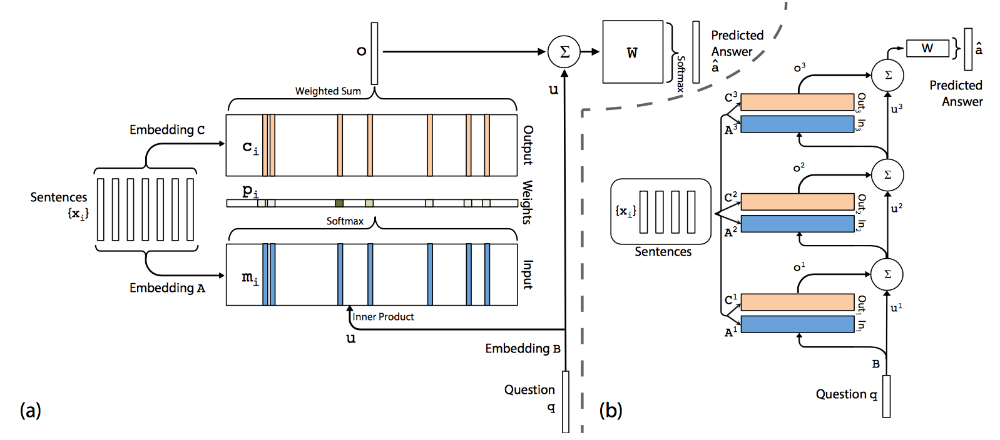  
  
조금 더 자세히 보면 Story를 Vector A로 부터 Embedding화 한후, 합쳐서 입력 m을 생성후, attention을 추가하여 확률 p까지 생성한다.  
다시  Story를 Vector C로 부터 Embedding화 한후, 합쳐서 context c를 생성하고, p와 곱하면 o가 완성된다.  
Question을 Vector B로 부터 Embedding화 한후, 합쳐서 u를 생성하고, dense vector W 와 (o+u)를 이용하최종 예측 a를 만들 수 있다.  
위의 과정은 single layer이며, 성능 향상을 위해 multi hop방식으로 layer를 늘린다.  
이때, hop의 수 k개 만큼 Vector A, Vector C를 늘리고, u_k+1 = u_k + o_k 방식으로 계층적 구조로 만든다.
  
single layer  
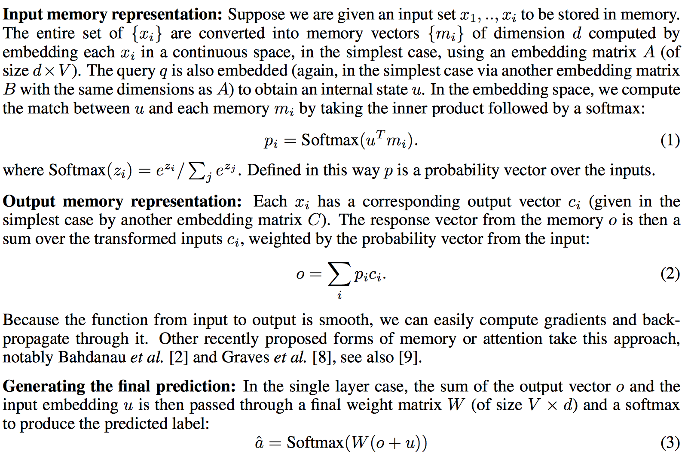  
  
multi hop  
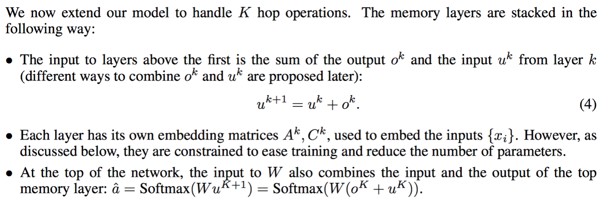  
  
#### 2. Additional options  
성능 향상을 위해 참조 논문을 토대로 몇가지 테크닉을 추가한다.  
본 프로젝트는 기본 모델에서 아래의 옵션 기능으로 추가, 수정 하였다.
  
2.1 Position Encoding  
문장-단어 구조에서 보통 Bag-of-Words(BOW) 방식으로 많이 사용하지만,  
단어의 위치 정보를 고려한 position encoding 정보를 embedding vector에 곱해준다.  
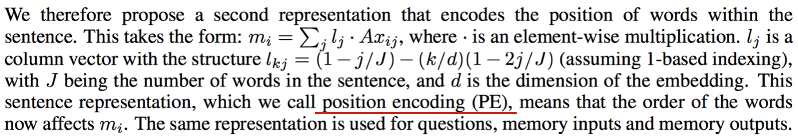  
  
2.2 Adjacent weight sharing  
multi hop 방식에서 A_k+1 = C_k, B = A0 로 변경하고, 마지막 W를 C_k로 사용한다.  
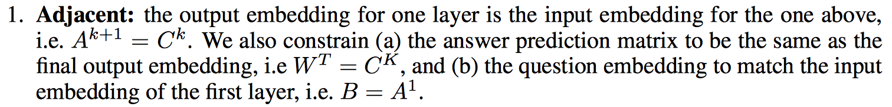  
  
2.3 Temporal encoding  
Story로 부터 m, c를 생성할때, A, C와는 별개의 T_A, T_C를 더해준다.  
T_A, T_C는 여러 문장의 순서에 따른 사실 관계 추론을 위한 추가 Vector이다.  
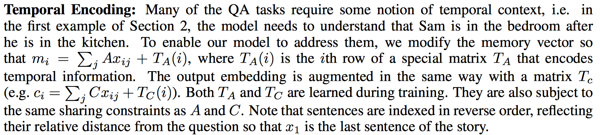  
  
### Test result  
본 프로젝트는 총 20종류의 데이터 중, 1번(single-supporting)과 16번(basic-induction) 내용을 사용하였다.  
  
#### qa1 : single supporting  
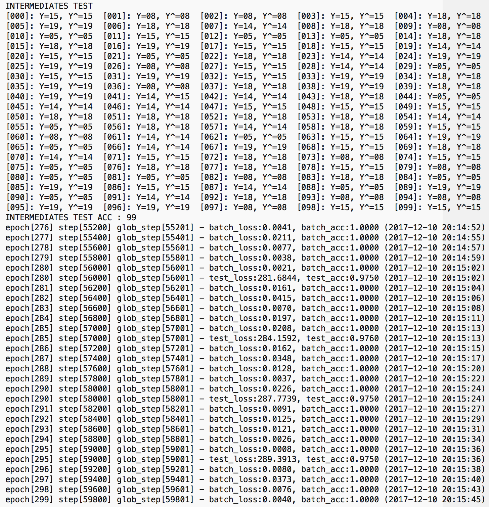  
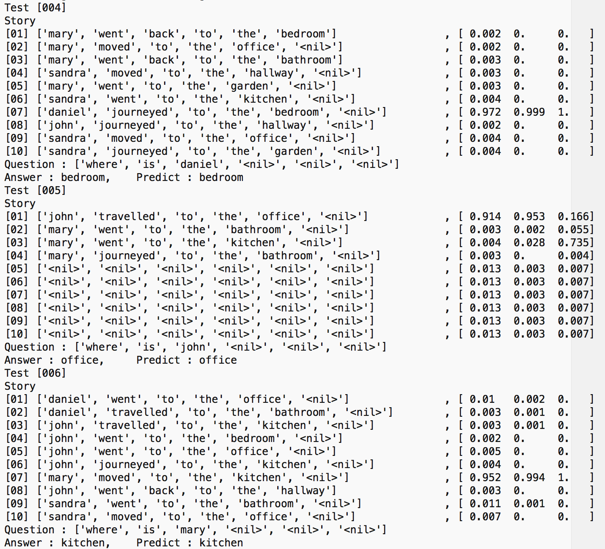  
  
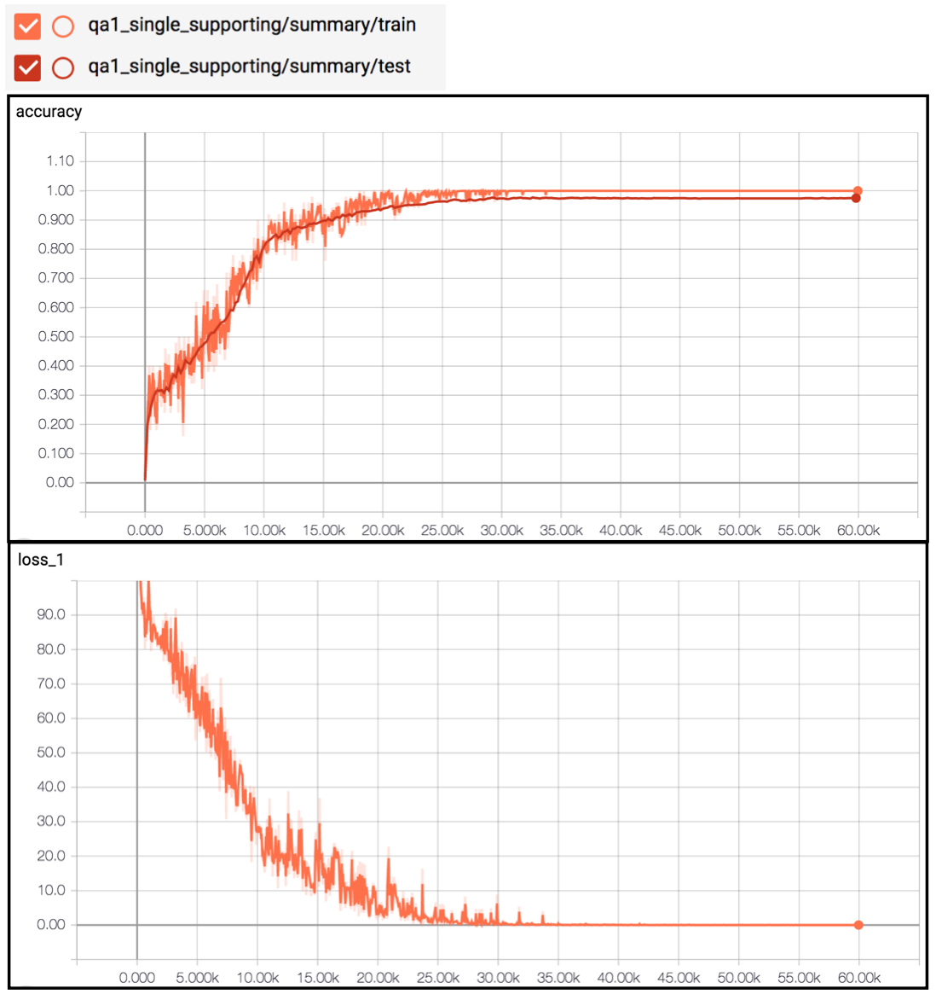  
  
#### qa16 : basic induction  
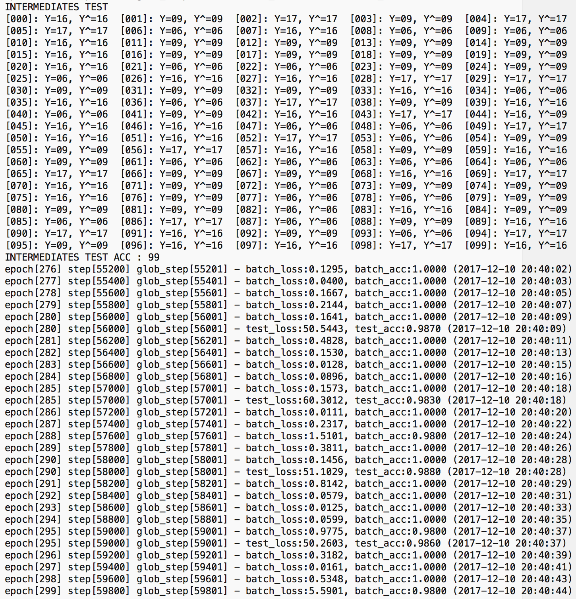  
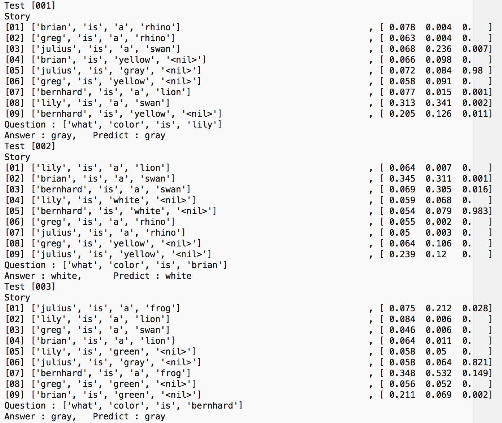  
  
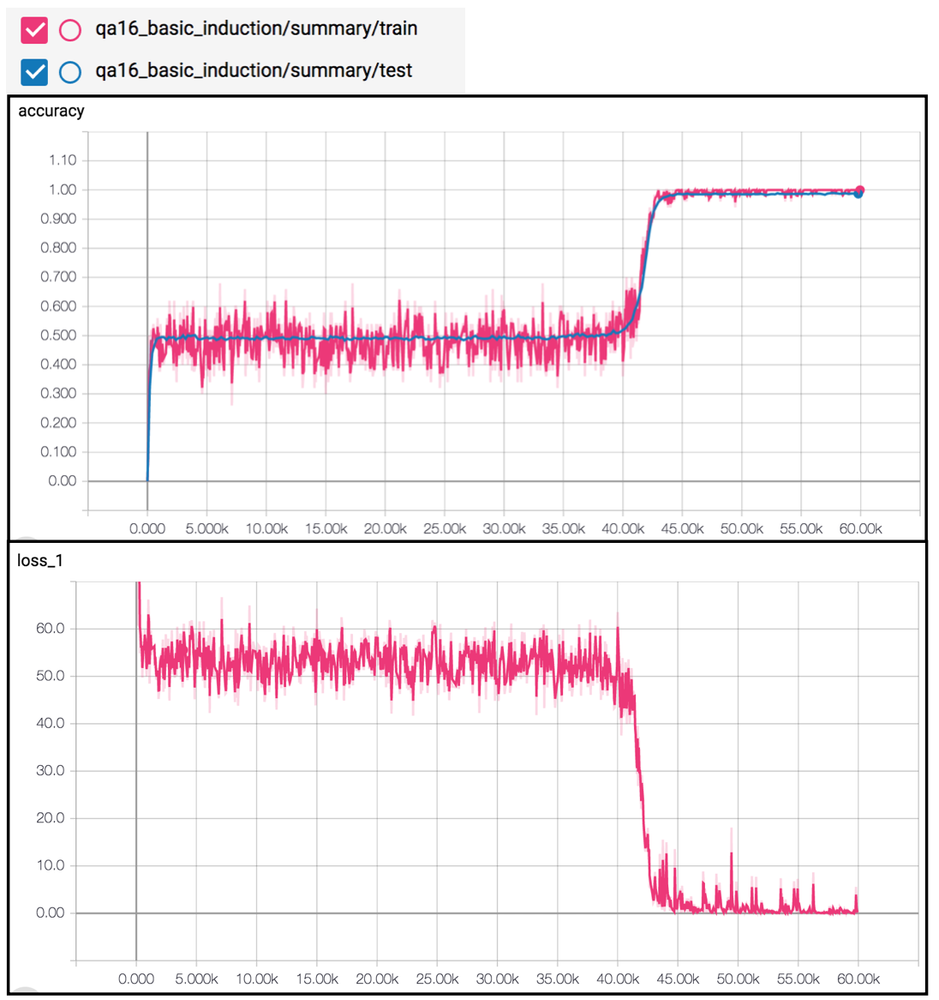  

